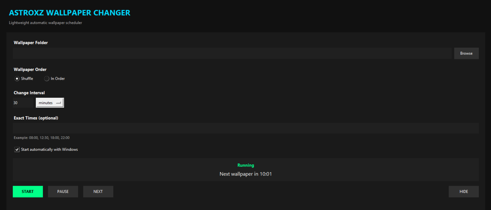

# ASTROXZ Wallpaper Changer 🖼️

A lightweight Windows wallpaper changer built with Python.

> Automatically change your Windows wallpaper on your own schedule.

## 📸 Preview



## ✨ Features

- 🔀 Shuffle wallpapers randomly
- 🔢 Change wallpapers in order
- ⏱️ Custom change intervals
- 📁 Choose your own wallpaper folder
- 🖼️ Supports multiple image formats
- 🔄 Add or remove wallpapers while the program is running
- 🪟 Uses the Windows desktop wallpaper API
- 🚫 Runs without requiring external Python packages

## 🚀 How to Use

### 1. Keep the files together

Place these files in the same folder:

```text
Wallpaper_changer.pyw
START_WALLPAPER_CHANGER.bat
```

### 2. Start the application

Double-click:

```text
START_WALLPAPER_CHANGER.bat
```

### 3. Select your wallpaper folder

Click **Browse** and choose the folder containing your wallpapers.

### 4. Choose a wallpaper mode

Select either:

* 🔀 **Shuffle**
* 🔢 **In order**

### 5. Select the interval

Choose how often the wallpaper should change.

Example:

```text
30 Minutes
```

### 6. Press START

Your wallpapers will now change automatically. 🎉

## 🖼️ Supported Image Formats

```text
JPG
JPEG
PNG
BMP
GIF
WEBP
```

## 📁 Example Folder

```text
D:\Wallpapers\

├── space.jpg
├── moon.png
├── galaxy.jpg
├── earth.jpg
├── nebula.png
└── blackhole.jpg
```

## 💻 Requirements

* Windows 10 / Windows 11
* Python 3.x
* No external Python packages required

## ⚙️ Important

The application directly uses the **Windows desktop wallpaper API**.

You can add or remove wallpapers from the selected folder while the program is running.

## 🛠️ Built With

* Python
* Windows API

---

### 👨‍💻 Created by ASTROXZ

*Think it. Build it. Improve it.*
